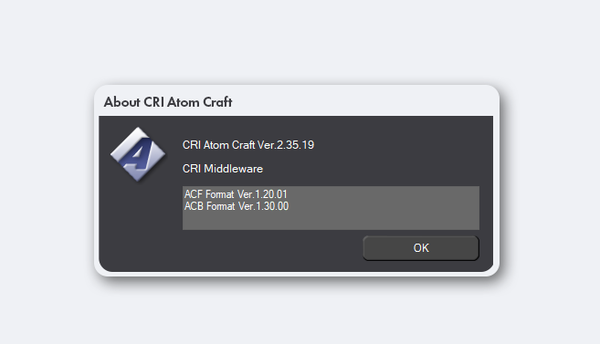

<div style="display:flex;flex-direction:row;">
	
	<h1>xrd744-fiber-atmc</h1>
</div>
___
This is a version control repository for recreating specific **Atom Configuration Files** ( .ACF ) and **Atom CueSheet Binaries** ( .ACB ) for SEGA' multiplatform release of *Persona 5 Royal Remaster Edition*, nicknamed fiber.

The final release will contain:
- /sound/xrd744.acf
- /sound/dungeon/dungeon_se.acb
- /sound/bgm.acb
- /sound/system.acb
- /sound/mementos.acb
- /sound/my_palace.acb

```
> [!WARNING]  
> This project is nowhere near completion! Don't expect builds anytime soon.
```

## Software
___
 This project is developed with *CRI Atom Craft Ver.2.35.19* ( atmc ) and will build correctly for versions that support:
 - ACF Format Ver.1.20.01
 - ACB Format Ver.1.30.00



Ver.3 builds, while more easily available for download, are **not** supported. Expect a severely non-matching .ACF and various bugs relating to Selectors and Automation AISAC. 
## Install
___
atmc projects are portable, but create user settings locally in the root directory as well as for each WorkUnit. Modified installs can be more safely moved around by deleting .atmcuser and .user_settings files. 

**Expect large files!** .ADX and .HCA are built from .WAV files which are already large to avoid artifacts from double compression. Reserve at least 3 Gigabytes for Application and Project. 

atmc projects by default are created in  `~/Documents/CriAtomCraft/`, this is a recommended location.
## Compatibility
___
This project is intended for fiber, but can theoretically be retrofitted to PS3, PS4, Switch, and Xbox. For versions of Persona 5 Royal released prior to fiber, some Cue IDs will be misaligned and the Project Encryption Key will need to be changed. 
For versions of Persona 5, most .ACB files contained are completely different and will not function at all. While the .ACF is unlikely to cause serious crashes, this project should preferably be used as reference material to make dedicated atmc projects.

## Testing
___
To easily verify Cue ID and Player / Voice configuration in-game, download [Ryo Framework](https://gamebanana.com/mods/549032) and configure "Developer Mode" to see Cue Triggers being printed to conhost.
